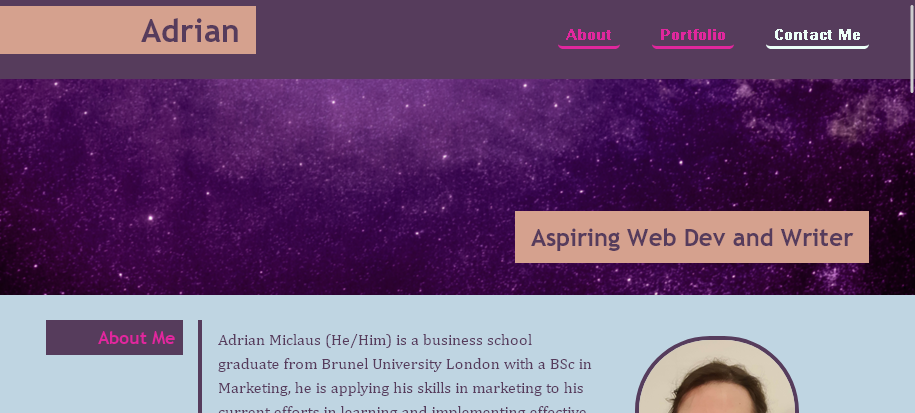
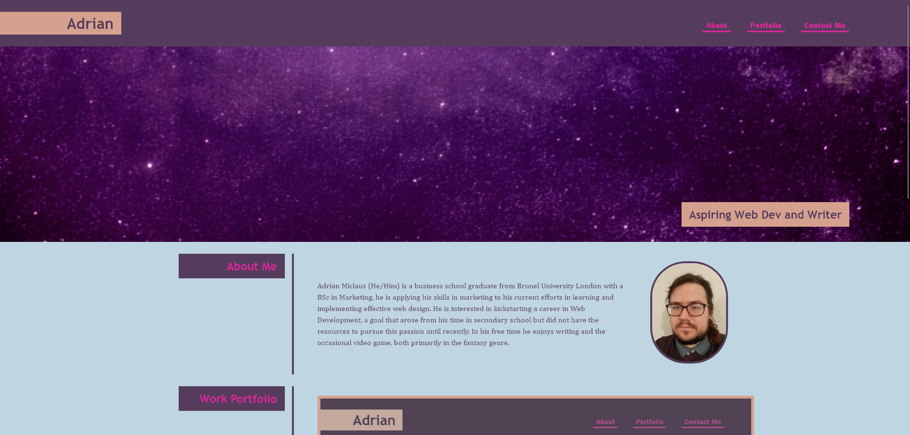

# Web Development Portfolio

## Description

This webpage exists to showcase my portfolio of projects, currently it contains a link to itself and four placeholders, with intent to update it and replace these placeholders with links to actual projects once I have made them.

Throughout this project I have applied the knowledge I have learned of both html tags and css styling in order to create a website that is responsive and viewable from smaller devices such as mobile phones and tablets.

## Installation

N/A

## Usage

There is little required to use this webpage, browse it as you see fit. If you click on the placeholders they will scroll you to them, sometimes this results in no change. If you click on the first project, you will simply reopen this website in a new tab, as it is currently the only project I can display.

## Credits

N/A

## Liscense

This Project is subject to the [MIT License.](LICENSE)